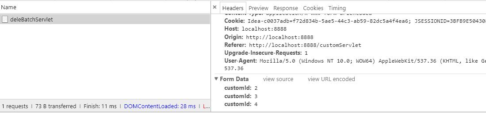
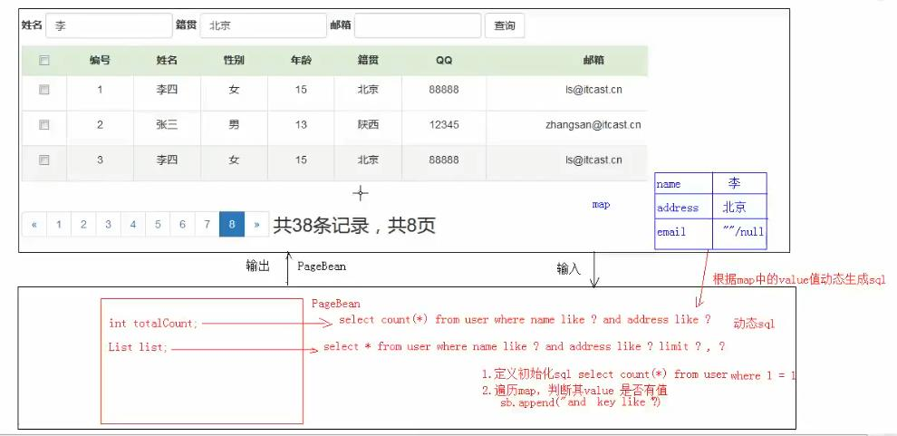

# 案例：用户信息列表展示

### 1. 需求：用户信息的增删改查

### 2.设计 

#### 1）技术选型：

servlet+jsp+MySQL+JDBCTemplate+Druid+BeanUtils(封装Bean对象)+tomcat 

#### 2）数据库设计

```
create database db4; -- 创建数据库
use db4; -- 使用数据库
-- 创建表
create table if not exists user( 
  id int(11) primary key auto_increment commit "用户id",
  name varchar(10) not null commit "姓名",
  gender varchar(5) ,
  age int(5),
  address varchar(50),
  qq varchar(15),
  email varchar(20)
);

```

### 3.开发

#### 1）环境的搭建：

创建项目，导入所需要的jar包


#### 2）编码

##### 简单功能

  列表查询、登陆、添加、删除、修改

##### 复杂功能

  删除选中、分页、复杂条件查询

### 4.测试

### 5. 部署运维


## （一）列表查询


## （二）登陆


## （三）添加用户信息

### 1. 过程分析


### 2. 编码实现

**add.jsp**：

```html
<%@ page contentType="text/html;charset=UTF-8" language="java" %>
<html>
<head>
    <title>添加用户</title>
    <!-- 最新版本的 Bootstrap 核心 CSS 文件 -->
    <link rel="stylesheet" href="bootstrap-3.3.7-dist/css/bootstrap.min.css" rel="stylesheet">
    <!-- jQuery (Bootstrap 的所有 JavaScript 插件都依赖 jQuery，所以必须放在前边) -->
    <script src="js/jquery-3.3.1.js"></script>
    <!-- 加载 Bootstrap 的所有 JavaScript 插件。你也可以根据需要只加载单个插件。 -->
    <!-- 最新的 Bootstrap 核心 JavaScript 文件 -->
    <script src="bootstrap-3.3.7-dist/js/bootstrap.min.js" rel="stylesheet"></script>
    <style type="text/css">
        body{
            padding: 0;
            margin: 0px auto;
        }
        #container{
            width: 500px;
            margin: 0 auto;
        }
    </style>
</head>
<body>
<div>
    <jsp:include page="head.jsp"></jsp:include>
</div>

<div id="container">
    <h3 style="margin: 10px 0px;text-align: center">添加用户信息</h3>
    <form id="myForm" action="${pageContext.request.contextPath}/addCustomServlet" method="post">
        <div class="form-group">
            <label for="name" class="control-label">姓名：</label>
            <input type="text" class="form-control" id="name" placeholder="请输入姓名" name="name">
        </div>

        <div class="form-group">
            <label class="control-label">性别:</label>
            <label class="radio-inline"><input type="radio" name="gender" value="男">男</label>
            <label class="radio-inline"><input type="radio" name="gender" value="女">女</label>
        </div>

        <div class="form-group">
            <label for="age" class="control-label">年龄：</label>
            <input type="text" class="form-control" id="age" placeholder="请输入年龄。例如：21" name="age">
        </div>

        <div class="form-group">
            <label for="address" class="control-label">籍贯：</label>
            <input type="text" class="form-control" id="address" placeholder="请输入籍贯省份。例如：陕西" name="address">
        </div>

        <div class="form-group">
            <label for="qq" class="control-label">QQ：</label>
            <input type="text" class="form-control" id="qq" placeholder="请输入QQ" name="qq">
        </div>

        <div class="form-group">
            <label for="email" class="control-label">邮箱：</label>
            <input type="text" class="form-control" id="email" placeholder="xxxx@example.com" name="email">
        </div>

        <div class="form-group" style="text-align: center;margin-top: 10px">
            <button type="submit" class="btn btn-primary btn-mid active">提交</button>
            <button type="reset" class="btn btn-danger btn-mid active">重置</button>
            <a href="${pageContext.request.contextPath}/show.jsp" class="btn btn-default btn-mid active" role="button">返回</a>
        </div>
    </form>

</div>
</body>
</html
```

**主要实现类**：

**AddCustomerServlet.java：**

```java
 //设置编码格式
        req.setCharacterEncoding("utf-8");
        resp.setContentType("text/html;charset=utf-8");

        //获取表单信息的map集合
        Map<String, String[]> map = req.getParameterMap();
        //创建Customer对象
        Customer customer = new Customer();
        try {
            //封装Customer对象
            BeanUtils.populate(customer,map);
        } catch (IllegalAccessException e) {
            e.printStackTrace();
        } catch (InvocationTargetException e) {
            e.printStackTrace();
        }

        System.out.println("customer对象："+customer);
        //使用service层调用saveCustomer(Customer customer)方法将数据提交到数据表customer中
        UserService service = new UserServiceImpl();
        boolean flag = service.save(customer);
        if(flag){//添加成功，跳转到show.jsp页面
            System.out.println("添加成功!");
            resp.sendRedirect(req.getContextPath()+"/customServlet");
        }else{//添加失败
            System.out.println("添加失败!");
            req.getRequestDispatcher("/add.jsp").forward(req,resp);
        }
```


**service层：**

```java

public interface UserService {
    //提交表单信息到数据库中
    boolean save(Customer customer);
}

//=====================================================================
public class UserServiceImpl  implements UserService {
    private CustomerDAO customerDAO = new CustomerDAOImpl();
    private UserDAO userDAO = new UserDAOImpl();

    //添加用户信息
    @Override
    public boolean save(Customer customer) {
        boolean flag = customerDAO.insertCustomer(customer);
        return flag;
    }
}

```

**dao层：**

```java

public interface CustomerDAO {
   //插入用户信息
    boolean insertCustomer(Customer customer);
}

//===================================================================================
public class CustomerDAOImpl implements CustomerDAO {
    private JdbcTemplate template = new JdbcTemplate(DruidUtil.getDaSource());
    //将customer信息保存到customer表中
    @Override
    public boolean insertCustomer(Customer customer) {
        String sql = "insert into customer(id,`name`,gender,age,address,qq,email) values(null,?,?,?,?,?,?)";
        int update = template.update(sql, customer.getName(), customer.getGender(), customer.getAge(), customer.getAddress(), customer.getQq(), customer.getEmail());
       if(update>0){
           return true;
       }
        return false;
    }
}
```


## （四）单个删除用户信息

### 1. 过程分析


### 2. 编码实现

**DeleCustomServlet.java：**

```java
@WebServlet("/deleCustomServlet")  //单个删除
public class DeleCustomServlet extends HttpServlet {
    @Override
    protected void doPost(HttpServletRequest req, HttpServletResponse resp) throws ServletException, IOException {
        doGet(req,resp);
    }

    @Override
    protected void doGet(HttpServletRequest req, HttpServletResponse resp) throws ServletException, IOException {
        //设置编码格式
        req.setCharacterEncoding("utf-8");
        resp.setContentType("text/html;charset=utf-8");

        int id = Integer.parseInt(req.getParameter("id"));
        UserService service = new UserServiceImpl();
       boolean flag =  service.deleById(id);
       if(flag){//删除成功，重新跳转到查询所有用户的servlet(customServlet)
           System.out.println("删除成功，删除的用户id为："+id);
           resp.sendRedirect(req.getContextPath()+"/customServlet");
       }else{//删除失败
           System.out.println("删除失败！");
           req.getRequestDispatcher("/show.jsp");
       }
    }
}

```

**service层：**

```java
public interface UserService {
    //根据用户id删除
    boolean deleById(int id);
}

//===================================================================
public class UserServiceImpl  implements UserService {
    private CustomerDAO customerDAO = new CustomerDAOImpl();
    private UserDAO userDAO = new UserDAOImpl();

    //根据id删除用户信息
    @Override
    public boolean deleById(int id) {
        boolean flag = customerDAO.deleById(id);
        return flag;
    }
}

```

**dao层：**

```java

public interface CustomerDAO {
    //根据Id删除用户信息
    boolean deleById(Integer id);
}
//======================================================================
public class CustomerDAOImpl implements CustomerDAO {
  //JdbcTemplate
    private JdbcTemplate template = new JdbcTemplate(DruidUtil.getDaSource());

    //根据id删除用户信息
    @Override
    public boolean deleById(Integer id) {
        String sql = "delete from customer where id=?";
        int dele = template.update(sql, id);

        if(dele>0){
            return true;
        }
        return false;
    }
}

```


**Tip：为了使用户更友好，在真正执行删除之前，弹出警告框提示是否要删除。**

```html
<body>
  <a type="button" class="btn btn-danger btn-sm" href="javascript:deleById(${customer.id})">
       <span class="glyphicon glyphicon-trash" aria-hidden="true"></span>  删除</a>
 <a type="button" class="btn btn-primary btn-sm">
        <span class="glyphicon glyphicon-pencil" aria-hidden="true"></span>  修改</a>
</body>

<!--====================================分割线========================================== -->
<script type="text/javascript">
  function deleById(id) {
      if(confirm("你确定要删除此用户吗？")){
          location.href="${pageContext.request.contextPath}/deleCustomServlet?id="+id;
      }
  }
</script>
```


## （五）修改用户信息

### 1. 过程分析

​        点击“修改”按钮，弹出一个回显了信息的模态框，在模态框中修改用户信息。然后点击“提交”按钮，将修改后的数据提交到数据库当中。模态框消失，显示修改后的用户信息。


### 2. 编码

实现代码：

控制层Servlet（UpdateCustomServlet.java）：

```java
@WebServlet("/updateCustomServlet")
public class UpdateCustomServlet extends HttpServlet {
    @Override
    protected void doPost(HttpServletRequest req, HttpServletResponse resp) throws ServletException, IOException {
       //设置字符编码
        req.setCharacterEncoding("utf-8");
        resp.setContentType("text/html;charset=utf-8");

        //获取表单参数的map集合
        Map<String, String[]> map = req.getParameterMap();
        //创建Customer对象
        Customer customer = new Customer();
        try {//封装Customer对象
            BeanUtils.populate(customer,map);
        } catch (IllegalAccessException e) {
            e.printStackTrace();
        } catch (InvocationTargetException e) {
            e.printStackTrace();
        }
        System.out.println("customer对象："+customer);

        //调用service层的updateCustomer(Customer customer)方法，操作数据库
        UserService service = new UserServiceImpl();
        boolean flag = service.updateCustomer(customer);
        if(flag){//修改成功，跳转会show.jsp页面
            System.out.println("修改成功");
            resp.sendRedirect(req.getContextPath()+"/customServlet");
        }
    }

    @Override
    protected void doGet(HttpServletRequest req, HttpServletResponse resp) throws ServletException, IOException {
        doPost(req,resp);
    }
}

```

service层：

```java
public interface UserService {
    //修改指定Id的用户信息
    boolean updateCustomer(Customer customer);
}


//=========================================================================
public class UserServiceImpl  implements UserService {
    private CustomerDAO customerDAO = new CustomerDAOImpl();
    private UserDAO userDAO = new UserDAOImpl();

    //修改指定客户Id的客户信息
    @Override
    public boolean updateCustomer(Customer customer) {
       boolean flag = customerDAO.updateCustomerById(customer);
        return flag;
    }
}

```

dao层：

```java
public interface CustomerDAO {
    //根据客户Id修改客户信息
    boolean updateCustomerById(Customer customer);
}

//===========================================================================
/*使用JDBCTemplate获得数据库连接池，从而对表进行操作*/
public class CustomerDAOImpl implements CustomerDAO {
    private JdbcTemplate template = new JdbcTemplate(DruidUtil.getDaSource());

    //根据客户Id修改客户信息
    @Override
    public boolean updateCustomerById(Customer customer) {
        String sql = "update customer set gender=?,age=?,address=?,qq=?,email=? where id=?";
        int update = template.update(sql, customer.getGender(), customer.getAge(), customer.getAddress(), customer.getQq(), customer.getEmail(), customer.getId());
        if(update>0){
            return true;
        }
        return false;
    }
}
```


**展示客户列表页面(show.jsp)：**

查找修改页面回显信息：

​        点击“修改”按钮，将请求发送到url映射为customByIdServlet的页面，并携带客户ID【id=${customer.id}】。将根据客户ID查询得到的客户信息发送到update.jsp页面，在修改表单页面回显信息

```html
 <a type="button" class="btn btn-danger btn-sm" href="javascript:deleById(${customer.id})">
                        <span class="glyphicon glyphicon-trash" aria-hidden="true"></span>  删除</a>
                    <a type="button" class="btn btn-primary btn-sm"  href="${pageContext.request.contextPath}/customByIdServlet?id=${customer.id}">
                        <span class="glyphicon glyphicon-pencil" aria-hidden="true"></span>  修改</a>
```


**修改客户信息页面(update.jsp)：**

​       在修改信息页面将客户信息修改后，点击“提交”按钮，将表单数据提交到客户修改的servlet(UpdateCustomServlet.java)页面。成功，跳转会show.jsp页面，失败，在原页面(update.jsp)。


update.jsp页面：

```jsp
<%@ page contentType="text/html;charset=UTF-8" language="java" %>
<%@ taglib  prefix="c" uri="http://java.sun.com/jsp/jstl/core" %>
<html>
<head>
    <title>用户修改信息</title>
    <!-- 最新版本的 Bootstrap 核心 CSS 文件 -->
    <link rel="stylesheet" href="bootstrap-3.3.7-dist/css/bootstrap.min.css" rel="stylesheet">
    <!-- jQuery (Bootstrap 的所有 JavaScript 插件都依赖 jQuery，所以必须放在前边) -->
    <script src="js/jquery-3.3.1.js"></script>
    <!-- 加载 Bootstrap 的所有 JavaScript 插件。你也可以根据需要只加载单个插件。 -->
    <!-- 最新的 Bootstrap 核心 JavaScript 文件 -->
    <script src="bootstrap-3.3.7-dist/js/bootstrap.min.js" rel="stylesheet"></script>

    <style type="text/css">
        body{
            padding: 0;
            margin: 0px auto;
        }
        #container{
            width: 500px;
            margin: 0 auto;
        }
    </style>
</head>
<body>
<div id="container">
    <h3 style="margin: 10px 0px;text-align: center">修改用户信息</h3>
    <form id="myForm" action="${pageContext.request.contextPath}/updateCustomServlet" method="post">
        <div class="form-group">
            <%--隐藏域，提交客户Id--%>
            <input type="hidden" value="${customer.id}" name="id">
            <label for="name" class="control-label">姓名：</label>
            <input type="text" class="form-control" id="name" name="name" value="${customer.name}" readonly="readonly">
        </div>

        <div class="form-group">
            <label class="control-label">性别:</label>
            <c:if test="${customer.gender == '男'}">
                <label class="radio-inline"><input type="radio" name="gender" value="男" checked>男</label>
                <label class="radio-inline"><input type="radio" name="gender" value="女">女</label>
            </c:if>

            <c:if test="${customer.gender == '女'}">
                <label class="radio-inline"><input type="radio" name="gender" value="男">男</label>
                <label class="radio-inline"><input type="radio" name="gender" value="女" checked>女</label>
            </c:if>
        </div>

        <div class="form-group">
            <label for="age" class="control-label">年龄：</label>
            <input type="text" class="form-control" id="age" name="age" value="${customer.age}">
        </div>

        <div class="form-group">
            <label for="address" class="control-label">籍贯：</label>
            <input type="text" class="form-control" id="address" name="address" value="${customer.address}">
        </div>

        <div class="form-group">
            <label for="qq" class="control-label">QQ：</label>
            <input type="text" class="form-control" id="qq" name="qq" value="${customer.qq}">
        </div>

        <div class="form-group">
            <label for="email" class="control-label">邮箱：</label>
            <input type="text" class="form-control" id="email" name="email" value="${customer.email}">
        </div>

        <div class="form-group" style="text-align: center;margin-top: 10px">
            <button type="submit" class="btn btn-primary btn-mid active">提交</button>
            <button type="reset" class="btn btn-danger btn-mid active">重置</button>
            <a href="${pageContext.request.contextPath}/show.jsp" class="btn btn-default btn-mid active" role="button">返回</a>
        </div>
    </form>
</div>
</body>
</html>
```


**Tip：**这里面存在一个隐藏input框，它主要是用来传递客户Id信息。隐藏input不影响布局。


## （六）删除选中(批量删除)

### 1. 过程分析


### 2. 编码

#### 1）获得选中的复选框所对应客户信息的ID


```jsp
<a type="button" class="btn btn-danger btn-sm" href="javascript:deleById(${customer.id})">
     <span class="glyphicon glyphicon-trash" aria-hidden="true"></span>  删除</a>
<a type="button" class="btn btn-primary btn-sm"  href="${pageContext.request.contextPath}/customByIdServlet?id=${customer.id}">
    <span class="glyphicon glyphicon-pencil" aria-hidden="true"></span>  修改</a>
 </td>

<!--===============================================================================-->
<script type="text/javascript">
    //批量删除(删除选中)
    window.onload=function (ev) {
        document.getElementById("delBatch").onclick=function () {
            if(confirm("你确定要删除吗?")){
               //提交表单数据
               document.getElementById("myform").submit();
            }
        }
    }
</script>
```




#### 2）批量删除（删除选中）功能的实现代码

**Servlet层：** 接收show.jsp页面上通过form表单提交过来的customId，创建service对象，调用deleBatch(String[] customIds)方法执行批量删除。

```java
@WebServlet("/deleBatchServlet")
public class DeleBatchServlet extends HttpServlet {

    @Override
    protected void doPost(HttpServletRequest req, HttpServletResponse resp) throws ServletException, IOException {
       //设置字符编码
        req.setCharacterEncoding("utf-8");
        resp.setContentType("text/html;charset=utf-8");

        String[] customIds = req.getParameterValues("customId");
       /* for(String customId:customIds){
            System.out.println(customId);
        }*/
       //调用service层的deleBatch(String[] customIds)方法
        UserService service = new UserServiceImpl();
       boolean flag = service.deleBatch(customIds);
       if(flag){
           System.out.println("删除成功!");
          // resp.sendRedirect(req.getContextPath()+"/customServlet");
           resp.sendRedirect(req.getContextPath()+"/findCustomByPageServlet");
       }else{
           System.out.println("删除失败!");
           req.getRequestDispatcher("/show.jsp").forward(req,resp);
       }
    }

    @Override
    protected void doGet(HttpServletRequest req, HttpServletResponse resp) throws ServletException, IOException {
        doPost(req,resp);
    }
}
```

**service层：**

```java
package com.zm.service;

public interface UserService {
    //删除选中
    boolean deleBatch(String[] customIds);
}

```

**实现类：**

```java
package com.zm.service.impl;

public class UserServiceImpl  implements UserService {
    private CustomerDAO customerDAO = new CustomerDAOImpl();
    private UserDAO userDAO = new UserDAOImpl();

    //批量删除(删除选中)
    @Override
    public boolean deleBatch(String[] customIds) {
        boolean flag = customerDAO.deleBatch(customIds);
        return flag;
    }

}

```

**dao层：**

```java
package com.zm.dao;

//数据库操作层
public interface CustomerDAO {
   //批量删除（删除选中）
    boolean deleBatch(String[] customIds);
}
```

**实现类：**

```java
package com.zm.dao.impl;

/*使用JDBCTemplate获得数据库连接池，从而对表进行操作*/
public class CustomerDAOImpl implements CustomerDAO {
    private JdbcTemplate template = new JdbcTemplate(DruidUtil.getDaSource());

    //批量删除(删除选中)
    @Override
    public boolean deleBatch(String[] customIds) {
        String sql = "delete from customer where 1=1 and id in(";
        for(String customId:customIds){
            int id = Integer.parseInt(customId);
            sql += id+",";
        }
        sql = sql.substring(0,sql.length()-1)+")";

        //执行批量删除
        int dele = template.update(sql);
        if(dele>0){//删除成功
            return true;
        }
        return false;
    }
}

```


## （七）分页显示

#### 1、过程分析

##### 1.1 逻辑过程分析

**明确实现分页显示的输入与输出分别是什么：**

 **输入：**页面大小rows；当前页码curPage。可以由计算所得的其他必需参数：

​       totalCount：总记录数 （通过`select count(*) from tbname；`获得）

​       totalPage：总页数（totalPage=totalCount%rows==0?totalCount/rows：totalCount/rows+1）

​       list：每页显示的数据的集合（ `select * from limit start,rows;`     其中，start=(curPage-1)*rows）

 **输出：**pageBean对象


##### 1.2 功能实现分析


#### 2、代码实现

**1）pageBean对象**

```java
package com.zm.model;

//分页对象
public class PageBean<T> implements Serializable {
    private Integer totalCount; //总记录数 select count(*) from customers;
    private Integer rows; //每一页显示的记录数
    private Integer totalPage; //总页码 totalPage = totalCount%rows==0?totalCount/rows:totalCount/rows+1
    private List<T> list; //每页要显示的数据集合
    private Integer curPage;  //当前页。

    public PageBean() {

    }

    public PageBean(Integer rows) {
        this.rows = rows;
    }

    public Integer getTotalCount() {
        return totalCount;
    }

    public void setTotalCount(Integer totalCount) {
        this.totalCount = totalCount;
    }

    public Integer getRows() {
        return rows;
    }

    public void setRows(Integer rows) {
        this.rows = rows;
    }

    public List<T> getList() {
        return list;
    }

    public void setList(List<T> list) {
        this.list = list;
    }

    public Integer getCurPage() {
        return curPage;
    }

    public void setCurPage(Integer curPage) {
        this.curPage = curPage;
    }

    public Integer getTotalPage() {
        return totalPage;
    }

    public void setTotalPage(Integer totalPage) {
        this.totalPage = totalPage;
    }

    @Override
    public String toString() {
        return "PageBean{" +
                "totalCount=" + totalCount +
                ", rows=" + rows +
                ", totalPage=" + totalPage +
                ", list=" + list +
                ", currPage=" + curPage +
                '}';
    }
}

```

**2）具体实现代码**

**web层：**

**show.jsp页面**：获取作用域中的pageBean对象，显示数据以及分页信息

```jsp
<body>
<div>
    <jsp:include page="head.jsp"></jsp:include>
</div>
<div class="container">
    <h2 style="text-align: center;margin: 20px">展示用户信息</h2>
    <%--添加表单以提交数据--%>
    <form action="${pageContext.request.contextPath}/deleBatchServlet" method="post" id="myform">
        <table class="table table-bordered table-hover" border="1px">
            <thead>
            <tr class="text-center">
                <td>
                    <input type="checkbox" class="allchks">
                </td>
                <td><strong>编号</strong></td>
                <td><strong>用户名</strong></td>
                <td><strong>性别</strong></td>
                <td><strong>年龄</strong></td>
                <td><strong>籍贯</strong></td>
                <td><strong>QQ</strong></td>
                <td><strong>邮箱</strong></td>
                <td><strong>操作</strong></td>
            </tr>
            </thead>
            <tbody>
            <c:forEach items="${pageBean.list}" varStatus="s" var="list">
                <tr class="text-center">
                    <td>
                        <input type="checkbox" class="chk" name="customId" value="${list.id}">
                    </td>
                    <td>${s.count}</td>
                    <td>${list.name}</td>
                    <td>${list.gender}</td>
                    <td>${list.age}</td>
                    <td>${list.address}</td>
                    <td>${list.qq}</td>
                    <td>${list.email}</td>
                    <td>
                        <a type="button" class="btn btn-danger btn-sm" href="javascript:deleById(${list.id})">
                            <span class="glyphicon glyphicon-trash" aria-hidden="true"></span>  删除</a>
                        <a type="button" class="btn btn-primary btn-sm"  href="${pageContext.request.contextPath}/customByIdServlet?id=${list.id}">
                            <span class="glyphicon glyphicon-pencil" aria-hidden="true"></span>  修改</a>
                    </td>
                </tr>
            </c:forEach>
            </tbody>
        </table>
    </form>

</div>

<div style="margin-left: 600px">
    <nav aria-label="Page navigation">
        <ul class="pagination">
            <c:if test="${pageBean.curPage<=1}">
                <li class="disabled">
                    <a href="${pageContext.request.contextPath}/findCustomByPageServlet?curPage=1&rows=5" aria-label="Previous">
                        <span aria-hidden="true">&laquo;</span>
                    </a>
                </li>
            </c:if>

            <c:if test="${pageBean.curPage>1}">
                <li>
                    <a href="${pageContext.request.contextPath}/findCustomByPageServlet?curPage=${pageBean.curPage-1}&rows=5" aria-label="Previous">
                        <span aria-hidden="true">&laquo;</span>
                    </a>
                </li>
            </c:if>
            <c:forEach begin="1" end="${pageBean.totalPage}" var="i">
                <c:if test="${pageBean.curPage == i}">
                    <li class="active">
                        <a href="${pageContext.request.contextPath}/findCustomByPageServlet?curPage=${i}&rows=5">${i}</a>
                    </li>
                </c:if>

                <c:if test="${pageBean.curPage != i}">
                    <li >
                        <a href="${pageContext.request.contextPath}/findCustomByPageServlet?curPage=${i}&rows=5">${i}</a>
                    </li>
                </c:if>
            </c:forEach>
            <c:if test="${pageBean.curPage<pageBean.totalPage}">
                <li>
                    <a href="${pageContext.request.contextPath}/findCustomByPageServlet?curPage=${pageBean.curPage+1}&rows=5" aria-label="Next">
                        <span aria-hidden="true">&raquo;</span>
                    </a>
                </li>
            </c:if>

            <c:if test="${pageBean.curPage>pageBean.totalPage}">
                <li class="disabled">
                    <a href="${pageContext.request.contextPath}/findCustomByPageServlet?curPage=${pageBean.totalPage}&rows=5" aria-label="Next" disabled="true">
                        <span aria-hidden="true">&raquo;</span>
                    </a>
                </li>
            </c:if>

           &emsp;<span style="font-size: 18px;font-weight: 500">共${pageBean.totalCount}条数据，共${pageBean.totalPage}页，当前是第${pageBean.curPage}页</span>
        </ul>
    </nav>
</div>
</div>
</body>

</html>
```


**findCustomByPageServlet.java：**

```java
package com.zm.web.servlet;

import com.zm.model.Customer;
import com.zm.model.PageBean;
import com.zm.service.UserService;
import com.zm.service.impl.UserServiceImpl;
import javax.servlet.ServletException;
import javax.servlet.annotation.WebServlet;
import javax.servlet.http.HttpServlet;
import javax.servlet.http.HttpServletRequest;
import javax.servlet.http.HttpServletResponse;
import java.io.IOException;

@WebServlet("/findCustomByPageServlet")
public class FindCustomByPageServlet extends HttpServlet {
    @Override
    protected void doPost(HttpServletRequest req, HttpServletResponse resp) throws ServletException, IOException {
        doGet(req, resp);
    }

    @Override
    protected void doGet(HttpServletRequest req, HttpServletResponse resp) throws ServletException, IOException {
        //设置字符编码
        req.setCharacterEncoding("utf-8");
        resp.setContentType("text/html;charset=utf-8");

        //获得当前页码信息
        String curPage = req.getParameter("curPage");//当前页码
        String rows = req.getParameter("rows");//每页显示的条数
        //做一个健壮性的判断
        if(curPage==null||"".equals(curPage)||Integer.parseInt(curPage)<=1){
            curPage = "1";
        }

        if(rows==null||"".equals(rows)){
            rows= "5";
        }

        UserService service = new UserServiceImpl();
        PageBean<Customer> pageBean = service.findCustomByPage(Integer.parseInt(curPage),Integer.parseInt(rows));
        req.setAttribute("pageBean",pageBean);

        req.getRequestDispatcher("/show.jsp").forward(req,resp);

    }
}
```


##### 细节说明：

1、实现点击某一页就显示某一页的数据

​          通过`<a></a>`标签，将当前页(curPage)和页面大小(rows)传递到映射为`findCustomByPageServlet`的servlet上。

```jsp
 <li >
    <a href="${pageContext.request.contextPath}/findCustomByPageServlet?curPage=${i}&rows=5">${i}</a>
</li>
```

2、实现前翻、后翻功能

```jsp
   <!--前翻-->        
<c:if test="${pageBean.curPage<=1}">
      <li class="disabled">
           <a href="${pageContext.request.contextPath}/findCustomByPageServlet?curPage=1&rows=5" aria-label="Previous">
             <span aria-hidden="true">&laquo;</span>
            </a>
       </li>
</c:if>

<c:if test="${pageBean.curPage>1}">
     <li>
         <a href="${pageContext.request.contextPath}/findCustomByPageServlet?curPage=${pageBean.curPage-1}&rows=5" aria-label="Previous">
           <span aria-hidden="true">&laquo;</span>
         </a>
     </li>
</c:if>

<!--======================================================================================= -->

<!--后翻 -->
<c:if test="${pageBean.curPage<pageBean.totalPage}">
   <li>
      <a href="${pageContext.request.contextPath}/findCustomByPageServlet?curPage=${pageBean.curPage+1}&rows=5" aria-label="Next">
        <span aria-hidden="true">&raquo;</span>
      </a>
  </li>
</c:if>

<c:if test="${pageBean.curPage>pageBean.totalPage}">
   <li class="disabled">
       <a href="${pageContext.request.contextPath}/findCustomByPageServlet?curPage=${pageBean.totalPage}&rows=5" aria-label="Next" disabled="true">
          <span aria-hidden="true">&raquo;</span>
       </a>
   </li>
</c:if>
```


​        在实现前翻和后翻时，有一个小细节：即当点击到第一页时，前翻的功能失效；点击到最后一页时，后翻的功能失效。实现这样的效果有两种方式：

方式1：在jsp页面中使用disabled属性设置禁用超链接

```jsp
<c:if test="${pageBean.curPage>pageBean.totalPage}">
   <li class="disabled">
       <a href="${pageContext.request.contextPath}/findCustomByPageServlet?curPage=${pageBean.totalPage}&rows=5" aria-label="Next" disabled="true">
          <span aria-hidden="true">&raquo;</span>
       </a>
   </li>
</c:if>
```


方式2：在servlet页面进行程序健壮性的设置

```java
 //获得当前页码信息
String curPage = req.getParameter("curPage");//当前页码
String rows = req.getParameter("rows");//每页显示的条数
//做一个健壮性的判断
if(curPage==null||"".equals(curPage)||Integer.parseInt(curPage)<=1){
  curPage = "1";
}

if(rows==null||"".equals(rows)){
  rows= "5";
}
```


## （八）复杂条件查询

**1、过程分析**




**2、实现的关键代码**


```jsp
 <form class="form-inline" action="${pageContext.request.contextPath}/findCustomByPageServlet" method="post">
            <div class="form-group">
                <label for="username">用户名：</label>
                <input type="text" class="form-control" id="username" placeholder="请输入用户名" name="name" value="${condition.name[0]}">
            </div>
            <div class="form-group">
                <label for="gender">性别：</label>
                <input type="text" class="form-control" id="gender" placeholder="男/女" name="gender" value="${condition.gender[0]}">
            </div>
            <div class="form-group">
                <label for="address">籍贯：</label>
                <input type="text" class="form-control" id="address" placeholder="请输入籍贯" name="address" value="${condition.address[0]}">
            </div>
            <button type="submit" class="btn btn-default">查询</button>
        </form>
```

在表单中输入复杂查询的条件，然后点击“查询”按钮，向后台findCustomByPageServlet 提交数据信息。


findCustomByPageServlet.java中的代码如下：

```java
@WebServlet("/findCustomByPageServlet")
public class FindCustomByPageServlet extends HttpServlet {
    @Override
    protected void doPost(HttpServletRequest req, HttpServletResponse resp) throws ServletException, IOException {
        //设置字符编码
        req.setCharacterEncoding("utf-8");
        resp.setContentType("text/html;charset=utf-8");

        //获得当前页码信息
        String curPage = req.getParameter("curPage");//当前页码
        String rows = req.getParameter("rows");//每页显示的条数
        //做一个健壮性的判断
        if(curPage==null||"".equals(curPage)||Integer.parseInt(curPage)<=1){
            curPage = "1";
        }

        if(rows==null||"".equals(rows)){
            rows= "5";
        }

        //获取复杂条件查询的表单数据
        Map<String, String[]> conditionMap = req.getParameterMap();

        UserService service = new UserServiceImpl();
        PageBean<Customer> pageBean = service.findCustomByPage(Integer.parseInt(curPage),Integer.parseInt(rows),conditionMap);
        req.setAttribute("pageBean",pageBean);
        req.setAttribute("condition",conditionMap); //将条件信息保存到req作用域中
        req.getRequestDispatcher("/show.jsp").forward(req,resp);

    }

    @Override
    protected void doGet(HttpServletRequest req, HttpServletResponse resp) throws ServletException, IOException {
        doPost(req,resp);
    }
}

```


在该servlet中，通过：

```java
  Map<String, String[]> conditionMap = req.getParameterMap();
```

获取了复杂查询条件参数。然后，将参数信息传递到`service`层中的`findCustomByPage(int curPage,int rows,Map<String,String[]> map)`中，执行按条件查询的方法，然后返回一个 `PageBean<Customer>`对象。

业务逻辑（service）层：

```java
public interface UserService {
    //获取分页后每页要显示的信息的集合
    PageBean<Customer> findCustomByPage(int curPage, int rows, Map<String, String[]> conditionMap);
}
```

对应的实现类：

```java
public class UserServiceImpl  implements UserService {
    private CustomerDAO customerDAO = new CustomerDAOImpl();
    private UserDAO userDAO = new UserDAOImpl();

    //显示分页信息的集合
    @Override
    public PageBean<Customer> findCustomByPage(int curPage, int rows, Map<String, String[]> conditionMap) {
        //1.创建一个空的PageBean对象
        PageBean<Customer> pageBean = new PageBean<Customer>();
        //2. 获取总记录数
        int totalCount = customerDAO.getTotalCount(conditionMap);
       //3.获取总页码
        int totalPage = totalCount%rows==0?totalCount/rows:totalCount/rows+1;

       //4.查询分页显示信息的集合
        //4.1 计算每页的起始记录数
        int start = (curPage-1)*rows;
        //4.2 调用findCustomByPage(start,rows)
        List<Customer>  list = customerDAO.findCustomByPage(start,rows,conditionMap);

        pageBean.setCurPage(curPage);
        pageBean.setRows(rows);
        pageBean.setTotalCount(totalCount);
        pageBean.setTotalPage(totalPage);
        pageBean.setList(list);

        return pageBean;
    }
}

```

数据操作(DAO)层：

```java
public interface CustomerDAO {
    //获取数据总记录数
    int getTotalCount(Map<String, String[]> conditionMap);
   //获取分页信息集合
    List<Customer> findCustomByPage(int start, int rows, Map<String,String[]> conditionMap);
}
```

对应的实现类：

```java
public class CustomerDAOImpl implements CustomerDAO {
    private JdbcTemplate template = new JdbcTemplate(DruidUtil.getDaSource());

    //获取总记录数
    @Override
    public int getTotalCount(Map<String, String[]> conditionMap) {
        String sql = "select count(*) from customer where 1=1 ";

        StringBuffer sb = new StringBuffer(sql);
        List<Object> parms = new ArrayList<>();//存放参数

        for(String key:conditionMap.keySet()){
            //排除curPage与rows在sql语句种的拼接
            if("curPage".equals(key)||"rows".equals(key)){
                continue;
            }
            String val = conditionMap.get(key)[0];
            if(val != null && !"".equals(val)){
               sb.append(" and "+key+" like ?");
               parms.add("%"+val+"%");
            }
            sql = sb.toString();
        }
       System.out.println(sql);
        System.out.println(parms);
       int totalCount = template.queryForObject(sql, Integer.class,parms.toArray());
       return totalCount;
        //return 0;
    }

 

    //获取分页信息集合
    @Override
    public List<Customer> findCustomByPage(int start, int rows, Map<String,String[]> conditionMap) {
        String sql = "select * from customer where 1=1 ";
        StringBuffer sb = new StringBuffer(sql);
        List<Object> parms = new ArrayList<>();//存放参数

        for(String key:conditionMap.keySet()){
            if("curPage".equals(key)||"rows".equals(key)){
                continue;
            }
            String val = conditionMap.get(key)[0];
            if(val != null && !"".equals(val)){
                sb.append(" and "+ key +" like ?");
                parms.add("%"+val+"%");
            }
        }
        sb.append(" limit ?,?");//拼接模糊查询
        parms.add(start);
        parms.add(rows);
        sql = sb.toString();
        System.out.println(sql);
        System.out.println(parms);
        List<Customer> list = template.query(sql, new BeanPropertyRowMapper<Customer>(Customer.class), parms.toArray());
        return list;
        //return null;
    }
}

```


## 总结

**遇到的问题：**

**1、Jquery文件的引用问题**


   在执行代码的的过程中，经常会报错：无法识别“$”。

主要解决方式：

 （1）检查jquery文件导入的路径是否有问题。

 （2）可能是应用的那个元素还没有创建出来，所以，需要将那部分代码写到window.onload中。

**2、事件绑定时机**

在单个删除功能中，若需要给

添加属性或者绑定事件时，需要在执行的过程中进行。通常使用$(元素).on(绑定的事件，回调函数)的方式绑定事件。

**3、原生属性赋/取值与自定义属性赋/取值**

attr(String name,Object value) 常用于自定义属性的取值和赋值；

pro(String name,Object value)常用于原生属性的取值和赋值。

